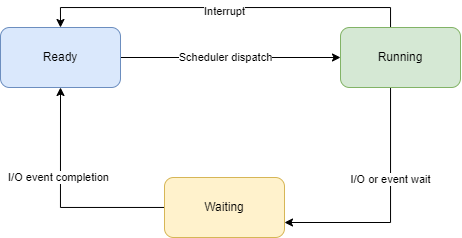

# Scheduler
### Deadline: **05/12/2023 23:59**
### Puteți găsi aici assignment-ul pentru tema: [Classroom assignment](https://classroom.github.com/a/2eN9hsMw)
### Pentru întrebări legate de temă, vă rugăm să deschideți un issue la [UPB-CS-Rust/teme](https://github.com/UPB-CS-Rust/teme) cu titlul: `[scheduler] <title issue>`. (titlul issue-ului e ce scrieți voi).
### Cunostiinte evaluate:
  * Utilizarea limbajului Rust
  * Utilizarea `trait`-urilor

### Reguli:
  1. Tema trebuie sa conțină un fișier numit README.md care să conțină explicații referitoare la modul de rezolvare al temei. (-0.1p)
  2. Tema trebuie implementată în Rust, utilizând **doar** funcții din biblioteca **standard** de Rust. Orice altă implementare va conduce la anularea temei. (0p)
  3. Puteți folosi orice structuri de date doriți pentru reprezentarea proceselor și a cozilor, irelevant dacă sunt sau nu eficiente

### Copiat
Tema trebuie rezolvată individual. Orice tentativă de copiat duce la acordarea punctajului **0p** pentru teme. Utilizăm un sistem automat de detectare a copiatului. Dacă avem dubii legate de implementarea voastră, vă vom adresa întrebări suplimentare în legătură cu tema.

  > **NU PUBLICAȚI COD SURSĂ**. Această acțiune se încadrează la copiat, lucru care va conduce la primirea punctajului **0p** pentru tema.

### Scheduler
Scopul acestei teme este de a crea un planificator de procese. Acesta trebuie să pună la dispoziție trei algoritmi de planificare:
  - Round Robin
  - Round Robin cu priorități
  - Completely Fair Schedule (CFS)

Planificatorul face parte din sistemul de operare. Deoarece scrierea codului în sistemul de operare este dificilă, în spațiul utilizatorului a fost implementat un simulator de procese.

Scopul acestei teme este să implementați un planificator de procese. Acesta va simula un planificator de procese preemptive, într-un sistem uniprocesor, care utilizează algoritmii `Round Robin`, `Round Robin cu priorități` și `CFS` (Completely Fair Schedule).

Pentru fiecare planificator, trebuie să implementați `trait`-ul `Scheduler`. Aceasta presupune implementarea tuturor celor trei funcții:
  - `next`- următorul proces de executat
  - `stop`- primiți informații despre motivul pentru care procesul s-a oprit
  - `list`- returnează starea proceselor

Pentru aceasta, puteți crea fișiere separate pentru fiecare planificator și le puteți exporta în `scheduler/src/schedulers/mod.rs`.

> Trebuie să implementați doar `trait`-ul `Scheduler` pentru cei 3 algoritmi de planificare. Alte informații prezentate mai jos sunt detalii de implementare ale modelului existent, astfel încât să înțelegeți mai bine cum funcționează planificatorul.

#### Timpul de execuție

Într-un sistem real, pentru controlul execuției, contorizarea timpului de execuție al unui proces se realizează la fiecare întrerupere de ceas.

Pentru ușurința implementării, șablonul de temă va simula un sistem real ca acesta:
  - Sistemul simulat va folosi timpul virtual (logic) independent de timpul real pentru a număra timpul de operare pe procesor.
  - Veți considera că o instrucțiune durează o singură perioadă de ceas (unitate logică de timp).
  - Fiecare dintre funcțiile prezentate mai sus reprezintă o singură instrucțiune executabilă de către un proces la un moment dat.

#### `Crate`-ul `Scheduler`

Această bibliotecă oferă `trait`-urile și structurile necesare pentru implementarea unui planificator de procese.

##### enum `ProcessState`

Această enumerare conține stările posibile ale unui proces pentru simularea noastră:
  - `Ready` - Procesul așteaptă să fie planificat
  - `Running` - Procesul este planificat
  - `Waiting` - Așteaptă după un eveniment sau o operație I/O

##### enum `SchedulingDecision`

Această enumerare conține acțiunea pe care procesul o cere de la sistemul de operare. De asemenea, reprezintă valoarea întoarsă de funcția `Scheduler::next`, pe care trebuie să o implementați:
  - `Run {pid, timeslice}` - Rulați procesul cu PID-ul `pid` pentru un număr maxim de `timeslice` unități de timp
  - `Sleep (time_units)` - Suspendați procesul de la planificare (trecere în starea `Waiting`) pentru cel puțin `time_units` unități de timp
  - `Deadlock` - Sistemul de operare nu mai poate continua, deoarece toate procesele așteaptă evenimente. În acest caz, niciun alt proces nu poate trimite evenimente, ceea ce înseamnă că toate procesele vor aștepta la nesfârșit.
  - `Panic` - Procesul cu PID-ul 1 s-a oprit.
  - `Done` - Nu mai sunt procese de planificat.

##### enum `StopReason`

Această enumerare conține motivul pentru care un proces s-a încheiat și sistemul de operare a rulat planificatorul:
  - `Syscall {syscall, remaining}` - Procesul a trimis un apel de sistem `Syscall`; `remaining` reprezintă numărul de unități de timp pe care procesul nu le-a folosit.
  - `Expired` - intervalul de timp alocat procesului a expirat și procesul a fost preemptat

##### enum `Syscall`

Această enumerare conține apelurile de sistem pe care procesele le fac către planificator:
  - `Fork(process_priority)` - Creează un nou proces și returnează PID-ul acestuia.
  - `Sleep(amount_of_time)` - Cereți planificatorului să suspende procesul pentru o anumită perioadă de timp
  - `Wait(event_number)` - Procesul va aștepta în starea `ProcessState::Waiting` până când un alt proces emite un apel de sistem `Syscall::Signal` cu acest număr de eveniment.
  - `Signal(event_number)` - Toate procesele care așteaptă acest eveniment vor fi trezite și plasate în starea `ProcessState::Ready`.
  - `Exit` - Cereți planificatorului să încheie procesul. Procesul nu va mai fi planificat niciodată și va fi eliminat din lista de procese pe care planificatorul le urmărește.

##### enum `SyscallResult`

Această enumerare conține rezultatul întors de către un apel de sistem:
  - `Pid(pid)` - PID-ul noului proces, este întors doar după un apel de sistem `Syscall::Fork`.
  - `Succes` - Apelul de sistem s-a executat cu succes.
  - `NoRunningProcess` - Apelul de sistem a fost emis când nu a fost planificat niciun proces.

#### Bibliotecta `processor`

Această bibliotecă este folosită pentru a simula execuția proceselor de către un procesor.

##### Structura `ProcessInfo`

Conține următoarele informații despre un proces:
  - `Pid`
  - `State`
  - `Timings`: 
    - durata totală de execuție (de la fork până la exit)
    - timpul de execuție al apelului de sistem
    - timpul de rulare

##### Simulatorul de procesor

Simulatorul folosește următoarele funcții:
  - `fork` - Trimite un apel de sistem `Syscall::Fork`
  - `exec` - Execută o unitate de timp.
  - `wait` - Trimite un apel de sistem `Syscall::Wait`
  - `signal` - Trimite un apel de sistem `Syscall::Signal`
  - `sleep` - Trimite un apel de sistem `Syscall::Sleep`
  - `exit` - Oprește procesul; procesul informează sistemul de operare că a terminat de executat

> Primul apel de sistem primit de către planificator trebuie să fie un `fork` , pentru a crea primul proces, altfel se va emite o eroare.

### Algoritmii de planificare

#### Round Robin

Pentru acest algoritm, toate procesele au aceeași prioritate și sunt planificate unul după altul. După ce un proces a fost planificat, acesta va fi plasat la sfârșitul cozii.

Procesele noi vor fi plasate la sfârșitul cozii.

Va ține o coadă cu procese în așteptare (sleep). Vor fi la coadă în ordinea în care au intrat în starea `sleep`. Înainte de fiecare planificare, puteți extrage procese din coadă care pot rula și le puteți adăuga la sfârșitul cozii de planificare (ready).

Procesul care tocmai a fost executat va fi adăugat ultimul în coadă.

#### Round Robin cu priorități

Acest algoritm este identic cu cel anterior, cu următoarea modificare: prioritatea inițială a procesului este cea pe care o primește la `fork`. Această prioritate nu poate fi niciodată depășită. De fiecare dată când un proces își depășește timpul alocat, adică nu se opreste singur (prin utilizarea un apel de sistem înainte de a fi preemptat), este penalizat cu 1. De fiecare dată când procesul renunță la procesor înainte de a-și depăși timpul alocat, este recompensat cu 1.

Prioritatea nu poate fi mai mică de 0 și nici mai mare de 5.

Pentru planificare, sunt luate în considerare numai procesele cu cea mai mare prioritate. Dacă niciunul dintre ele nu poate fi planificat (este în starea waiting), se vor lua în considerare procesele cu prioritate mai mică. Dacă niciunul nu poate fi planificat nici aici, se vor lua în considerare procesele cu prioritatea și mai mică, etc.

> Pentru compararea prioritățiilor dintre processe, se va implementa `trait`-ul `PartialOrd`.

#### Completely Fair Scheduler (CFS)

Acest algoritm este folosit de Linux. Puteți găsi mai multe detalii la [CFS: Perfectly Fair Process Scheduling in Linux](https://opensource.com/article/19/2/fair-scheduling-linux). Varianta implementată aici va ține cont de următoarele aspecte:
  - timpul virtual
  - durata de timp variază în funcție de numărul de procese, timpul real este timpul inițial împărțit la numărul de procese, timpul de referință nu poate fi mai mic de 1.

> După fiecare execuție a unui proces vom adăuga numărul de unități de procesare executate de proces la `virtualruntime` (valoarea este de fapt `quantum_time - process.quantum`).

> Pentru compararea `virtualruntime`-ului dintre processe, se va implementa `trait`-ul `PartialOrd`.
> Pentru adăugarea de `virtualruntime` se va implementa `trait`-ul `Add`.
